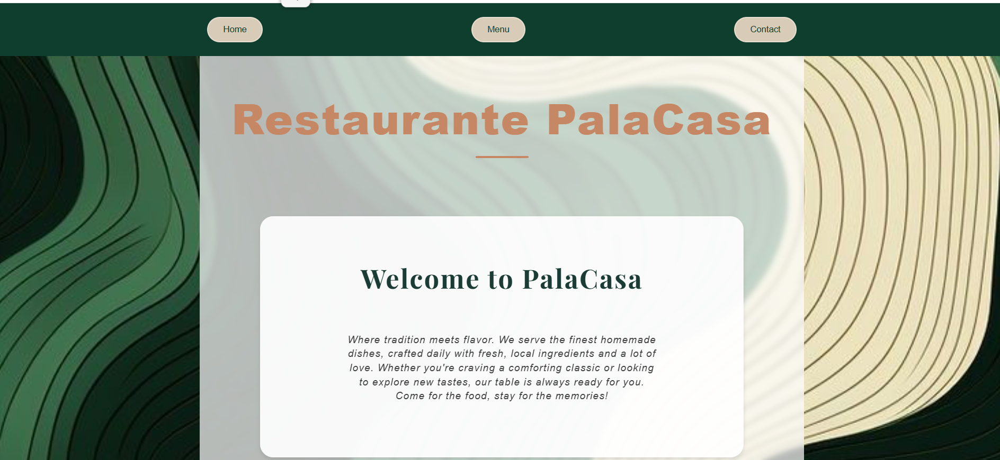

# 🍽️ Restaurant Page

A modern restaurant website built with JavaScript and bundled using Webpack.

This project focuses on dynamic DOM rendering, modular JavaScript architecture, and responsive design.

---

## 🚀 Live Demo

👉 https://gparej0.github.io/Restaurant-Page/

---

## 📸 Preview



---

## ✨ Features

- Dynamic page rendering with JavaScript
- Tab navigation system
- Responsive layout
- Modular code structure
- Webpack bundling
- Modern restaurant landing page design

---

## 🛠️ Technologies Used

- HTML5
- CSS3
- JavaScript
- Webpack
- npm

---

## 📂 Project Structure

```bash
📦 Restaurant-Page
 ┣ 📂 src
 ┃ ┣ 📜 contact.js
 ┃ ┣ 📜 home.js
 ┃ ┣ 📜 menu.js
 ┃ ┣ 📜 index.js
 ┃ ┣ 📜 style.css
 ┃ ┣ 📜 template.html
 ┃ ┗ 📜 wallpaper.jpg
 ┣ 📂 node_modules
 ┣ 📜 package.json
 ┣ 📜 webpack.config.js
 ┗ 📜 README.md
```

---

## 📚 What I Learned

With this project I practiced:

- DOM manipulation
- JavaScript modules
- Webpack configuration
- Dynamic content rendering
- Responsive web design
- Component-based structure

---

## ⚙️ Installation

Clone the repository:

```bash
git clone https://github.com/GParej0/Restaurant-Page.git
```

Install dependencies:

```bash
npm install
```

Run the development server:

```bash
npm run start
```

Build for production:

```bash
npm run build
```

---

## 👤 Author

Guillermo

- GitHub: https://github.com/GParej0

---

## ⭐ Support

If you like this project, give it a star on GitHub ⭐
